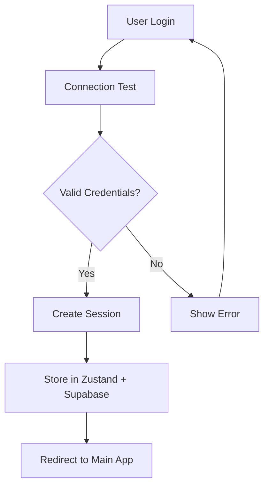
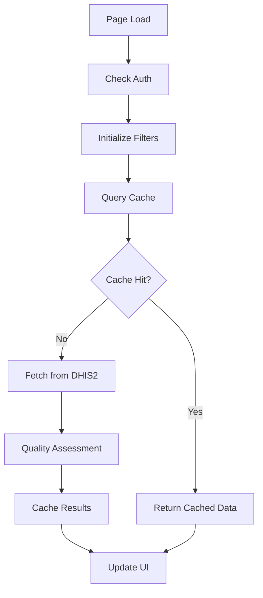
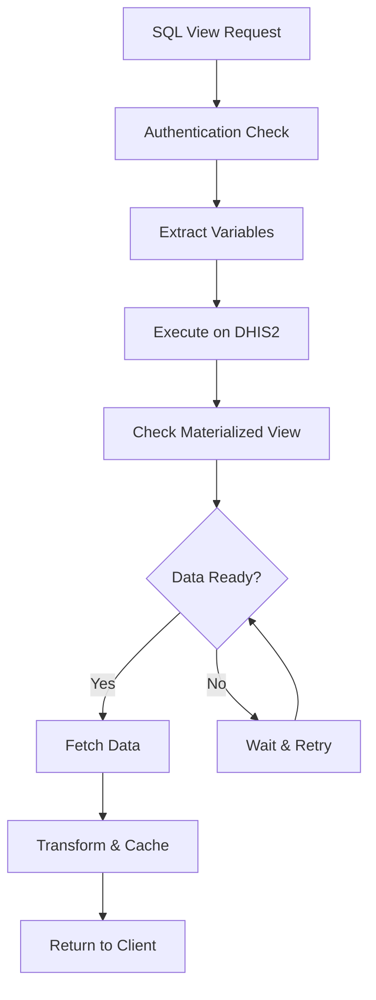

# DHIS2 Metadata Dictionary - Comprehensive System Documentation

## Table of Contents
1. [System Overview](#system-overview)
2. [Architecture & Technology Stack](#architecture--technology-stack)
3. [Application Pages & Features](#application-pages--features)
4. [Information Flow & Data Architecture](#information-flow--data-architecture)
5. [System Interconnections](#system-interconnections)
6. [Performance & Optimization](#performance--optimization)
7. [Security & Authentication](#security--authentication)
8. [Development & Deployment](#development--deployment)

---

## System Overview

The **DHIS2 Metadata Dictionary** is a comprehensive web application designed for exploring, assessing, and documenting DHIS2 metadata quality with advanced SQL view functionality. The system provides a modern, performant interface for metadata analysis, quality assessment, and data export capabilities.

### Key Capabilities
- **Multi-source DHIS2 Integration**: Connect to various DHIS2 instances
- **Advanced SQL View Management**: Execute, debug, and optimize SQL views
- **Metadata Quality Assessment**: Automated quality scoring and reporting
- **Interactive Data Visualization**: Tables, filters, and export functionality
- **Performance Optimization**: Virtualization, caching, and batch processing
- **Comprehensive Authentication**: Multi-tier authentication with session management

---

## Architecture & Technology Stack

### Frontend Architecture
```
Next.js 15.3.2 (App Router)
├── React 18 (Client Components)
├── TypeScript (Type Safety)
├── Tailwind CSS (Styling)
├── Zustand (Client State)
├── React Query (Server State)
└── @tanstack/react-virtual (Performance)
```

### Backend Architecture
```
Next.js API Routes
├── DHIS2 Integration Layer
├── Supabase (Sessions & Caching)
├── Service Layer (Composition Pattern)
├── Authentication Middleware
└── Quality Assessment Engine
```

### Service Layer Pattern
The system uses a **composition-based service architecture**:

```typescript
// Service Orchestration
SqlViewService {
  ├── SqlViewApiService      // DHIS2 API communication
  ├── SqlViewCacheService    // Memory caching
  ├── SqlViewTransformService // Data transformation
  └── OptimizedCacheService  // LRU cache management
}
```

---

## Application Pages & Features

### 1. **Landing Page** (`/`)
**Purpose**: Authentication and system entry point
**Features**:
- DHIS2 connection setup form
- Pre-configured demo credentials
- Connection testing and validation
- Auto-redirect for authenticated users

**Technical Details**:
- Uses `useAuthStore` for state management
- Real-time connection testing via `/api/dhis2/test-connection`
- Responsive form design with loading states

### 2. **Authentication Page** (`/auth`)
**Purpose**: Dedicated authentication interface
**Features**:
- Clean credential setup interface
- Multiple authentication methods support
- Session management integration

**Technical Details**:
- Leverages `CredentialSetup` component
- Integrated with authentication middleware
- Supports environment variable fallbacks

### 3. **SQL Views Hub** (`/(auth)/sql-views`)
**Purpose**: Central SQL view management and navigation
**Features**:
- Quick SQL view testing interface
- Navigation to all metadata sections
- System status monitoring
- Cache management tools
- Enhanced feature showcase

**Key Components**:
- SQL View ID input with demo defaults
- Navigation cards for all metadata types
- System status indicators
- Feature explanation panels

### 4. **Data Elements** (`/(auth)/data-elements`)
**Purpose**: Comprehensive data element analysis and management
**Features**:
- **Standard View**: Traditional table with filters and pagination
- **SQL Debug Mode**: Raw JSON viewer with manual table generation
- **Enhanced Multi-Page Analysis**: Advanced fetching with progress tracking
- **Saved Metadata Manager**: Storage and retrieval of analysis results

**Advanced Capabilities**:
- Multi-tab interface with distinct functionality
- Interactive filtering and sorting
- Export capabilities (CSV, JSON)
- Quality assessment integration
- Mobile-responsive design

**Technical Implementation**:
```typescript
// Tab-based architecture
const tabs = {
  standard: MetadataTable + MetadataFilters,
  debug: SqlViewDataDisplay + SqlViewDebugger,
  enhanced: EnhancedSqlViewTable + ProgressTracking,
  saved: SavedMetadataManager + VersionHistory
};
```

### 5. **Indicators** (`/(auth)/indicators`)
**Purpose**: Indicator metadata management
**Features**:
- Similar structure to data elements
- Indicator-specific quality assessments
- Formula validation and analysis
- Export functionality

### 6. **Dashboards** (`/(auth)/dashboards`)
**Purpose**: Dashboard metadata exploration
**Features**:
- Dashboard component analysis
- Visualization metadata extraction
- Export and documentation capabilities

### 7. **SQL Views Demo** (`/(auth)/sql-views/demo`)
**Purpose**: Advanced SQL view testing and demonstration
**Features**:
- Real-time SQL view execution
- Multi-page data fetching
- Progress tracking and error handling
- Interactive table generation

### 8. **Setup & Configuration** (`/setup/sql-views`)
**Purpose**: System configuration and SQL view templates
**Features**:
- SQL view template management
- Configuration parameter setup
- Connection testing utilities

---

## Information Flow & Data Architecture

### 1. **Authentication Flow**


**Authentication Methods** (Priority Order):
1. **Session ID + Authorization Header** (Stateless API)
2. **Cookie-based Sessions** (Browser requests)
3. **Direct Header Authentication** (External integrations)

### 2. **Metadata Fetching Flow**


### 3. **SQL View Execution Flow**


### 4. **Data Transformation Pipeline**
```typescript
// Multi-stage data processing
const pipeline = {
  fetch: dhis2Api.execute(sqlViewId),
  transform: transformService.normalize(response),
  assess: qualityService.analyze(metadata),
  cache: cacheService.store(results),
  display: uiService.render(processedData)
};
```

---

## System Interconnections

### 1. **DHIS2 Integration Layer**
**Connection Points**:
- `/api/dataElements` - Data element metadata
- `/api/indicators` - Indicator definitions
- `/api/dashboards` - Dashboard configurations
- `/api/sqlViews` - SQL view execution
- `/api/analytics` - Data analytics (if enabled)

**Authentication Integration**:
- Basic Authentication with DHIS2 credentials
- Session-based token management
- Automatic session refresh
- Multi-instance support

### 2. **Supabase Integration**
**Data Storage**:
- **Sessions Table**: User session management
- **Cache Table**: Metadata and SQL view results
- **Quality Assessments**: Persistent quality scores
- **Saved Analyses**: User-generated content

**Connection Pattern**:
```typescript
// Supabase service integration
const supabaseClient = createClient(
  process.env.NEXT_PUBLIC_SUPABASE_URL!,
  process.env.NEXT_PUBLIC_SUPABASE_ANON_KEY!
);
```

### 3. **Service Interconnections**
```typescript
// Service dependency graph
AuthService → SessionService → MetadataService
                            ↓
SqlViewService → CacheService → TransformService
                            ↓
QualityService → ExportService → UIComponents
```

### 4. **API Route Interconnections**
```typescript
// API route dependency flow
/api/auth/dhis2 → /api/supabase/sessions → /api/dhis2/proxy
                                        ↓
/api/dhis2/data-elements ← /api/metadata/quality
/api/dhis2/sql-views ← /api/dhis2/test-connection
```

---

## Performance & Optimization

### 1. **Caching Strategy**
**Multi-Level Caching**:
- **Browser Cache**: React Query with 5-minute stale time
- **Memory Cache**: LRU cache with 200MB limit
- **Database Cache**: Supabase for persistent storage
- **DHIS2 Cache**: Materialized view optimization

**Cache Configuration**:
```typescript
// Optimized cache settings
const cacheConfig = {
  memory: { maxSize: 200 * 1024 * 1024 }, // 200MB
  query: { staleTime: 5 * 60 * 1000 },    // 5 minutes
  gc: { time: 15 * 60 * 1000 },           // 15 minutes
  lru: { evictionPolicy: 'leastRecentlyUsed' }
};
```

### 2. **Virtualization for Large Datasets**
**Implementation**:
- `@tanstack/react-virtual` for table virtualization
- Dynamic row height calculation
- Overscan for smooth scrolling
- Memory-efficient rendering

```typescript
// Virtualization configuration
const virtualizer = useVirtualizer({
  count: data.length,
  getScrollElement: () => parentRef.current,
  estimateSize: () => 80,
  overscan: 10,
});
```

### 3. **Code Splitting & Lazy Loading**
**Optimization Techniques**:
- Route-level code splitting
- Component-level lazy loading
- Dynamic imports for heavy components
- Bundle size optimization

### 4. **Batch Processing**
**Large Dataset Handling**:
- Configurable batch sizes (default 1000 rows)
- Progress tracking for long operations
- Memory-aware processing
- Error recovery and retry logic

---

## Security & Authentication

### 1. **Authentication Security**
**Features**:
- **httpOnly cookies** for session tokens
- **No credential storage** in client-accessible areas
- **Session expiration** with automatic cleanup
- **CSRF protection** headers

### 2. **Data Protection**
**Measures**:
- **Input validation** on all API endpoints
- **SQL injection protection** via parameterized queries
- **Authentication requirement** on all data endpoints
- **Environment variable security**

### 3. **Session Management**
**Security Features**:
- **24-hour session expiration**
- **Automatic session refresh**
- **Secure session storage** in Supabase
- **Session invalidation** on logout

---

## Development & Deployment

### 1. **Development Workflow**
```bash
# Development commands
npm run dev                  # Start development server (Turbopack)
npm run build               # Production build
npm run build:analyze       # Build with bundle analyzer
npm run type-check          # TypeScript validation
npm run lint                # ESLint linting
npm run test:build          # Full build pipeline test
```

### 2. **Environment Configuration**
```env
# Required environment variables
NEXT_PUBLIC_DHIS2_BASE_URL=https://dhis2-instance.org/api
DHIS2_USERNAME=username
DHIS2_PASSWORD=password
NEXT_PUBLIC_SUPABASE_URL=https://project.supabase.co
NEXT_PUBLIC_SUPABASE_ANON_KEY=anon_key
SUPABASE_SERVICE_ROLE_KEY=service_role_key
```

### 3. **Performance Benchmarks**
- **Development Server Start**: ~638ms (with Turbopack)
- **Build Time**: ~1000ms (optimized)
- **Cache Hit Rate**: Target >80%
- **Memory Usage**: <200MB cache limit
- **Bundle Size**: Optimized with tree-shaking

### 4. **Deployment Architecture**
**Recommended Setup**:
- **Frontend**: Vercel/Netlify for Next.js deployment
- **Database**: Supabase for session and cache storage
- **DHIS2**: Existing DHIS2 instance integration
- **CDN**: Automatic asset optimization

---

## Key System Features Summary

### 1. **Multi-Modal Data Access**
- Traditional table views with filtering
- Debug mode with raw JSON inspection
- Enhanced multi-page analysis with progress tracking
- Saved analysis management with version history

### 2. **Advanced SQL View Management**
- Real-time SQL view execution
- Variable extraction and substitution
- Batch processing for large datasets
- Error handling and retry logic

### 3. **Quality Assessment Engine**
- Automated metadata quality scoring
- Persistent quality assessment storage
- Quality-based filtering and sorting
- Export functionality with quality metrics

### 4. **Performance Optimization**
- Virtualized tables for large datasets
- Multi-level caching strategy
- Code splitting and lazy loading
- Memory-optimized data processing

### 5. **Comprehensive Authentication**
- Multi-tier authentication methods
- Session management with automatic refresh
- Secure credential handling
- Multi-instance DHIS2 support

This system represents a sophisticated, production-ready solution for DHIS2 metadata management with modern web technologies, comprehensive caching, and performance optimization strategies.